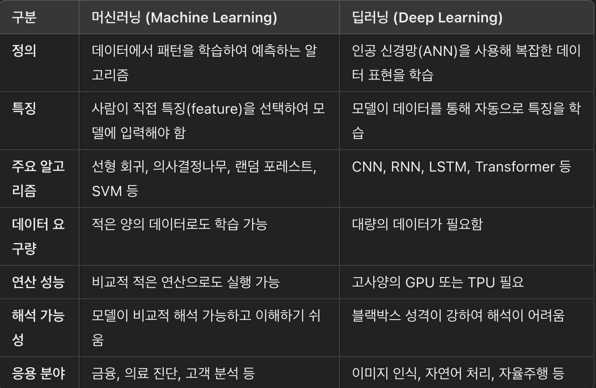

## 주제
<!-- 이번 주차에 다룬 주요 주제를 작성해주세요 --> 
1. 머신러닝과 딥러닝의 차이점
2. 여러 경사하강법의 최적화의 차이점

## 내용
<!-- 주요 개념과 내용을 정리해주세요 --> 
1. 머신러닝과 딥러닝의 차이점

- 머신러닝은 인공 지능의 한 분야
  - 알고리즘이 데이터를 분석하고 학습하여, 주어진 문제를 해결하는 능력을 개발하는 기술
    - 명시적인 프로그래밍 없이도 컴퓨터가 학습할 수 있게 하는 기술이며, 다양한 알고리즘과 통계적 방법을 활용
    - 머신러닝은 대량의 데이터로부터 패턴을 인식하고 이를 바탕으로 예측이나 분류 같은 작업을 수행

  - 주요 머신러닝 알고리즘: 지도 학습, 비지도 학습, 강화 학습 등이 있으며, 각각 다른 종류의 학습 방식을 제공
    - 지도 학습: 입력과 그에 해당하는 출력 예시를 사용하여 함수의 매핑을 학습하는 방법
    - 비지도 학습: 출력 예시 없이 입력 데이터만을 바탕으로 패턴을 찾아내는 방법
    - 강화 학습: 시행착오를 통해 최적의 결정을 내리는 과정을 학습

- 딥러닝은 머신러닝의 한 분야
    - 인공 신경망을 기반으로 한 알고리즘을 사용하여, 보다 복잡한 문제를 해결
        - 딥러닝 모델은 사람의 뇌 구조에서 영감을 받은 여러 계층의 신경망으로 구성됨
        - 대량의 데이터와 복잡한 알고리즘을 사용하여, 인지적인 작업(예: 이미지 인식, 음성 인식, 자연어 처리)을 수행하기에 충분한 능력을 갖추고 있음
        - 컨볼루션 신경망(CNN), 순환 신경망(RNN)과 같은 특수한 구조의 신경망은 특정 유형의 데이터 처리에 매우 효과적

    - 딥러닝의 핵심: 대량의 레이블이 붙은 데이터를 사용하여 심층 신경망을 학습시키는 것 
        - 모델은 데이터의 고차원적 특징을 자동으로 학습
        - 복잡한 문제를 해결할 수 있는 능력을 개발

- 머신러닝과 딥러닝의 차이
    - 머신러닝과 딥러닝은 둘 다 데이터로부터 학습하는 인공 지능의 분야이지만, 머신러닝은 주로 소량의 데이터셋을 사용하여 분석하고 패턴을 인식하는 반면, 딥러닝은 대량의 데이터를 처리하고 보다 복잡한 패턴을 인식할 수 있는 능력을 가짐
    - 딥러닝 모델은 학습 과정에서 데이터의 추상적인 특성을 스스로 학습할 수 있으나, 전통적인 머신러닝 모델은 이러한 특성을 사람이 직접 정의해야 함
    - 딥러닝은 이미지 인식, 음성 인식, 자연어 처리와 같이 인간의 뇌가 수행하는 복잡한 작업을 모방하는 데 더 적합한 기술이지만,  머신러닝은 구조화된 데이터를 사용한 예측 및 분류 작업에 주로 사용됩니다.

    
    ㄴ 머신러닝과 딥러닝의 차이점 세부 구분

- 머신러닝 vs 딥러닝
  - 머신러닝 사용: 데이터가 적거나, 수집 비용이 많이 드는 경우, 
모델의 해석 가능성이 중요한 경우 (의료, 금융 등), 학습 및 실행 속도가 중요한 경우
  - 딥러닝 사용: 대량의 데이터가 있고, 높은 정확도가 필요한 경우, 이미지, 음성, 자연어 등 복잡한 패턴이 필요한 경우, 사람이 직접 특징을 정의하기 어려운 경우

2. 여러 경사하강법의 최적화의 차이점
- 경사하강법: 머신러닝과 딥러닝에서 손실 함수(loss function)를 최소화하기 위해 사용되는 최적화 알고리즘
  - 각 기법마다 장단점이 있으며, 문제의 특성에 따라 적절한 방법을 선택해야 함
  

- 추가적인 설명(개념들 비유)
  - 배치 경사하강법: 산을 내려갈 때, 전체 지형을 한 번에 분석하고 신중하게 움직이는 등산가
  - 확률적 경사하강법: "눈 감고 내려가는 등산가" → 빠르게 움직이지만 흔들리며 목표를 찾기 어려움
  - 미니배치 경사하강법: "지도 보면서 내려가는 등산가" → 너무 천천히도, 너무 빠르지도 않게 이동
  - 모멘텀: "썰매를 타고 내려가는 등산가" → 가속도가 붙어 더 빠르게 이동 가능
  - Adagrad: "길의 경사도를 고려해 속도를 조절하는 등산가" → 지형이 가파르면 속도를 줄이고, 완만하면 속도를 높임
  - RMSProp: "최근 지형만 고려하여 속도를 조절하는 등산가" → 오래된 정보는 무시하고 최신 지형을 반영
  - Adam: "AI 등산가" → 경사도와 과거 기록을 모두 고려하여 최적의 경로를 찾아 이동
  
- 각 상황에서 사용되는 최적화 알고리즘
  - 딥러닝: Adam 가장 자주 사용
  - 큰 데이터셋: Mini-batch Gradient Descent가 효율적
  - 특정 상황: Adagrad와 RMSprop도 유용하게 사용

  

  
